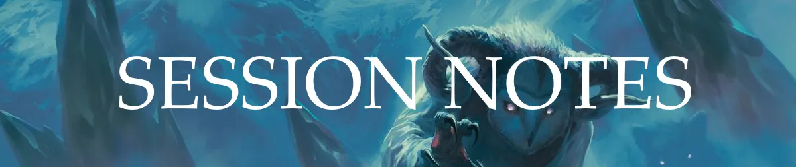
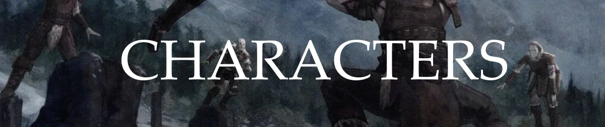
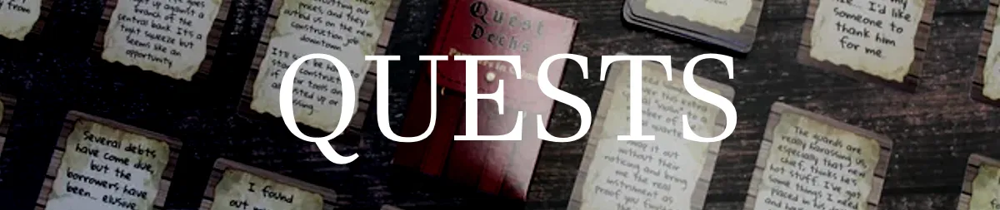
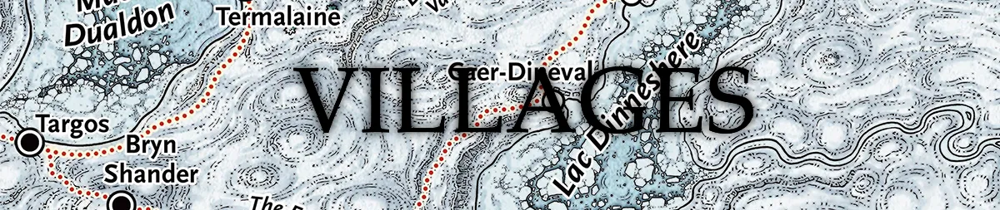
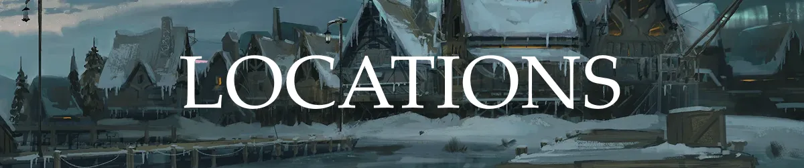

-   

    ---

    De beschrijvingen van de gebeurtenissen tijdens de campaign, verdeeld in individuele sessies.

    [:octicons-arrow-right-24: Sessies](/dnd-icewind-dale/Sessions/Sessions)

-   

    ---

    Alle karakters die we hebben ontmoet, hebben gesproken of over hebben gehoord, maar ook beschreven waar ze vandaan komen.

    [:octicons-arrow-right-24: Characters](/dnd-icewind-dale/Characters/Characters)

-   

    ---

    Opdrachten die door de karakters zijn benoemd die we kunnen uitvoeren binnen Icewind Dale.

    [:octicons-arrow-right-24: Quests](/dnd-icewind-dale/Quests/Quests)

-   

    ---

    De dorpjes van Icewind Dale. De namen waar een ijs icoontje achter staan zijn de dorpjes die we al eens hebben bezocht.

    [:octicons-arrow-right-24: Villages](/dnd-icewind-dale/Villages/Villages)

-   

    ---

	### Creatures
    Monsters en andere levende wezens die we zijn tegen gekomen of hebben verslagen in een gevecht.

    [:octicons-arrow-right-24: Creatures](/dnd-icewind-dale/Creatures/Creatures)

-   

    ---

	 ### Locations
    Van herbergen tot hotels. Plekken waar we hebben geslapen, gegeten of gedronken, maar ook gebieden zoals [[Sea of Moving Ice]].

    [:octicons-arrow-right-24: Locations](/dnd-icewind-dale/Locations/Locations)

